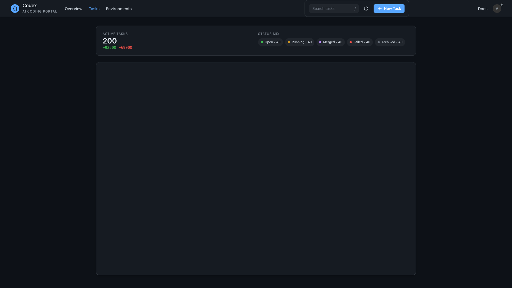

# Agent Frontend

A modern React + TypeScript application for managing AI agent tasks and development environments. Built with Vite, Fluent UI, and React Query for optimal performance and developer experience.


## 🚀 Features

- **Task Management** - Create, track, and manage AI agent tasks with real-time status updates
- **Environment Configuration** - Set up and manage development environments with health monitoring
- **Voice Input** - Speech-to-text input for natural task descriptions using Web Speech API
- **Real-time Updates** - Live task status monitoring with simulated WebSocket connections
- **Responsive Design** - Optimized for desktop and mobile devices with dark/light theme support
- **Type Safety** - Full TypeScript coverage with strict type checking
- **Modern UI** - Built with Microsoft's Fluent UI design system

## 📸 Screenshots

| Home Page | Tasks Page |
|-----------|------------|
|  |  |

| Settings Page |
|---------------|
|  |

## 🛠 Technology Stack

- **Frontend Framework**: React 18 with TypeScript
- **Build Tool**: Vite for fast development and optimized builds
- **UI Library**: Fluent UI (Microsoft Design System)
- **State Management**: React Query for server state, Zustand for client state
- **Routing**: React Router v7 with file-based routing
- **Styling**: Griffel (CSS-in-JS) with design tokens
- **Testing**: Vitest + React Testing Library + jsdom
- **Code Quality**: ESLint + TypeScript strict mode

## 🏗 Architecture

The application follows a modern component-based architecture:

```
┌─────────────────────────────────────────┐
│            React Application            │
├─────────────────────────────────────────┤
│  Routes → Components → Hooks → API      │
│    │         │          │       │      │
│    │         │          │       └─ Mock APIs
│    │         │          └─ Custom Hooks
│    │         └─ Fluent UI Components
│    └─ React Router v7
└─────────────────────────────────────────┘
```

### Key Patterns
- **Provider Hierarchy**: React Query → Theme → Router
- **Mock-First Development**: All APIs use mock data for development
- **Component Composition**: Reusable UI components with clear interfaces
- **Type-Safe State**: TypeScript interfaces for all data structures

## 🚀 Quick Start

### Prerequisites
- Node.js 18+ (recommended: latest LTS)
- npm 8+

### Installation
```bash
# Clone the repository
git clone <repository-url>
cd agent-frontend

# Install dependencies
npm install
cd portal
npm install

# Start development server (recommended)
./scripts/start.sh   # Smart start with environment checks

# OR manual start
cd portal && npm run dev
```

The application will be available at `http://localhost:5173`

## 🎛 Server Management

### Quick Start Scripts
```bash
# Start development server (recommended)
./scripts/start.sh   # Includes environment validation and setup

# Stop development server
./scripts/stop.sh    # Gracefully stops all processes

# Restart server
./scripts/stop.sh && ./scripts/start.sh
```

**Why use the scripts?**
- ✅ Automatic environment validation (Node.js, npm, dependencies)
- 📦 Auto-installs missing dependencies
- 🔍 Checks for port conflicts
- 🛡️ Graceful shutdown handling
- 📊 Clear status reporting

### Development Commands
```bash
cd portal

# Development
npm run dev          # Start dev server with hot reload
npm run build        # Build for production
npm run preview      # Preview production build

# Testing
npm test             # Run tests
npm test -- --coverage  # Run tests with coverage
npm test -- --watch     # Run tests in watch mode

# Code Quality
npm run lint         # Run ESLint
npm run lint -- --fix   # Auto-fix ESLint issues
```

## 📁 Project Structure

```
agent-frontend/
├── docs/                    # 📚 Comprehensive documentation
│   ├── api/                # API documentation and models
│   ├── architecture/       # System design and patterns
│   ├── components/         # Component usage guides
│   ├── development/        # Setup and workflow guides
│   ├── deployment/         # Production deployment guides
│   └── screenshots/        # Visual documentation
├── portal/                  # 🎯 Main React application
│   ├── public/             # Static assets
│   ├── src/
│   │   ├── app/           # Application core (routes, router)
│   │   ├── components/    # Reusable UI components
│   │   ├── hooks/         # Custom React hooks
│   │   ├── api/           # API layer (currently mocked)
│   │   ├── types/         # TypeScript definitions
│   │   ├── lib/           # Utility functions
│   │   └── theme/         # Theme configuration
│   ├── package.json       # Dependencies and scripts
│   └── vite.config.ts     # Build configuration
├── scripts/                 # 🔧 Development server management
│   ├── start.sh            # Smart server start with validation
│   ├── stop.sh             # Graceful server shutdown
│   └── README.md           # Script documentation
├── package.json            # Root package (screenshot utility)
├── screenshot.js           # Automated screenshot tool
├── AGENTS.md               # AI agent development guidelines
├── CLAUDE.md               # Claude Code development guidance
└── README.md              # This file
```

## 🧪 Testing

Current test coverage: **32.2%** (Goal: 80%+)

```bash
# Run all tests
npm test

# Run with coverage report
npm test -- --coverage

# Test specific components
npm test -- TaskListPage.test.tsx
```

### Testing Strategy
- **Unit Tests**: Individual functions and components
- **Integration Tests**: Component interactions and API calls
- **E2E Tests**: Full user workflows (planned)

See [Test Coverage Plan](./portal/test-coverage-plan.md) for detailed testing roadmap.

## 🎨 Component Library

Built with **Fluent UI** components and follows Microsoft's design principles:

- **Consistent Design**: Design tokens for colors, typography, spacing
- **Accessibility**: ARIA labels, keyboard navigation, screen reader support
- **Responsive**: Mobile-first design with breakpoints
- **Dark/Light Theme**: Automatic theme switching based on user preference

### Key Components
- **TaskList**: Complex task management with filtering and sorting
- **MainInputComponent**: Voice and text input with real-time processing
- **EnvironmentTable**: Environment configuration management
- **CodeDiffViewer**: Syntax-highlighted code diff visualization

## 🔌 API Integration

Currently uses **mock APIs** for development:

- **Task API**: CRUD operations for task management
- **Environment API**: Environment configuration and monitoring
- **Real-time Events**: Simulated WebSocket connections for live updates

The mock-first approach allows for rapid development and easy testing while the backend is being developed.

### Future API Integration
- RESTful APIs with React Query
- WebSocket connections for real-time features
- Authentication and authorization
- Error handling and retry logic

## 🌟 Key Features Deep Dive

### Voice Input
- **Web Speech API** integration with browser compatibility checking
- **Real-time transcription** with visual feedback
- **Error handling** for unsupported browsers or permission issues
- **Accessibility** considerations for users who cannot use voice input

### Task Management
- **Filter and search** tasks by status, repository, or content
- **Real-time status updates** with visual indicators
- **Task creation** with voice or text input
- **Status transitions** with optimistic updates

### Environment Configuration
- **Health monitoring** for development environments
- **Configuration management** with validation
- **Activity tracking** and logging
- **CRUD operations** with data tables

### Responsive Design
- **Mobile-first** approach with progressive enhancement
- **Flexible layouts** that adapt to screen size
- **Touch-friendly** interactions for mobile devices
- **Optimized performance** across devices

## 🚀 Deployment

### Static Site Hosting
Deploy to popular platforms:

- **Netlify**: Zero-config deployment with automatic builds
- **Vercel**: Optimized for React applications
- **GitHub Pages**: Free hosting with GitHub Actions
- **AWS S3 + CloudFront**: Scalable enterprise deployment

### Docker Deployment
```bash
# Build Docker image
docker build -t agent-frontend .

# Run container
docker run -p 3000:80 agent-frontend
```

See [Deployment Guide](./docs/deployment/README.md) for detailed instructions.

## 📖 Documentation

Comprehensive documentation is available in the `docs/` directory:

- **[📋 API Documentation](./docs/api/README.md)** - API endpoints and data models
- **[🏗 Architecture Overview](./docs/architecture/overview.md)** - System design and patterns
- **[🧩 Component Guide](./docs/components/README.md)** - UI component documentation
- **[⚙️ Development Setup](./docs/development/setup.md)** - Environment setup and workflow
- **[🚀 Deployment Guide](./docs/deployment/README.md)** - Production deployment

## 🤖 AI Agent Development

This project includes comprehensive guidance for AI coding agents:

**[AGENTS.md](./AGENTS.md)** - Complete AI agent guidelines including:
- 🎯 Project-specific code patterns and conventions
- 🔧 Development environment setup and workflows
- 📝 Component development patterns with TypeScript
- 🧪 Testing strategies and coverage goals
- 🚀 Performance and security best practices

The AGENTS.md follows the emerging open standard for AI agent guidance, helping AI tools understand project context and generate better code aligned with established patterns.

## 🤝 Contributing

1. **Fork the repository**
2. **Create a feature branch**: `git checkout -b feature/amazing-feature`
3. **Make your changes** following the established patterns
4. **Add tests** for new functionality
5. **Run the test suite**: `npm test`
6. **Lint your code**: `npm run lint`
7. **Commit changes**: `git commit -m 'Add amazing feature'`
8. **Push to branch**: `git push origin feature/amazing-feature`
9. **Open a Pull Request**

### Development Guidelines
- Follow TypeScript strict mode
- Use Fluent UI components and design tokens
- Write comprehensive tests for new features
- Maintain consistent code style with ESLint
- Update documentation for significant changes
- **AI Developers**: Review [AGENTS.md](./AGENTS.md) for project-specific patterns

## 📄 License

This project is licensed under the ISC License - see the [LICENSE](LICENSE) file for details.

## 🎯 Roadmap

### Near Term (Next 2-4 weeks)
- [ ] Increase test coverage to 80%+
- [ ] Implement real WebSocket connections
- [ ] Add authentication and user management
- [ ] Enhanced error handling and user feedback

### Medium Term (1-3 months)
- [ ] Backend API integration
- [ ] Advanced task management features
- [ ] Real-time collaboration
- [ ] Progressive Web App (PWA) features

### Long Term (3-6 months)
- [ ] Mobile application
- [ ] Advanced analytics and reporting
- [ ] Integration with external development tools
- [ ] Multi-tenant support

## 🆘 Support

- **Documentation**: Check the [docs/](./docs/) directory
- **Issues**: Report bugs or request features via GitHub Issues
- **Development**: See [Development Setup Guide](./docs/development/setup.md)
- **Architecture**: Review [Architecture Overview](./docs/architecture/overview.md)

## ⭐ Acknowledgments

- **Microsoft Fluent UI** for the excellent component library and design system
- **Vite** for the fast and modern build tooling
- **React Query** for powerful server state management
- **Vitest** for the fast and modern testing framework

---

**Built with ❤️ using React, TypeScript, and modern web technologies**