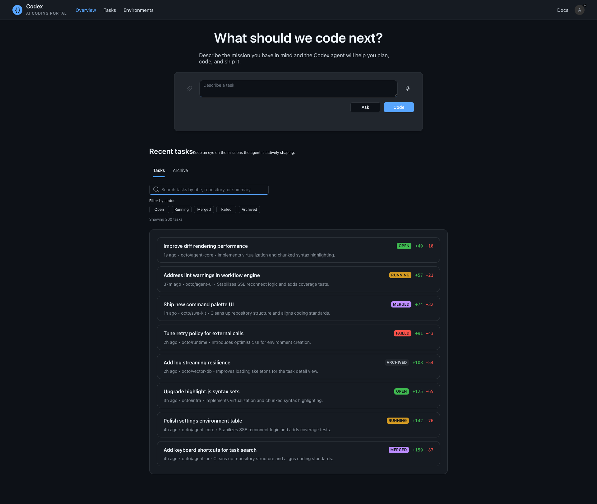
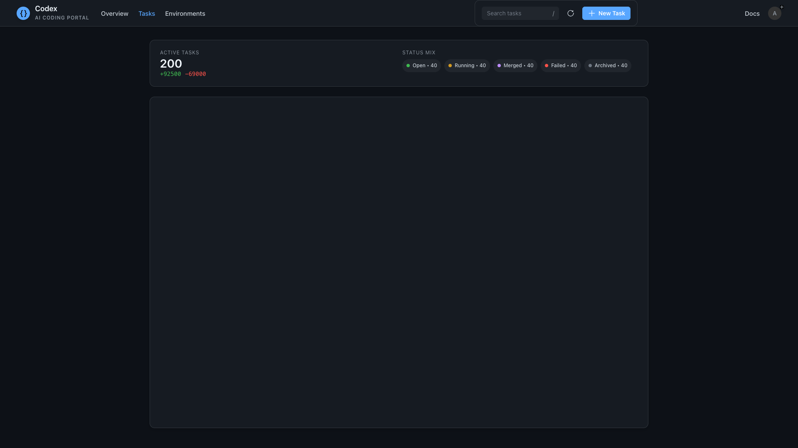
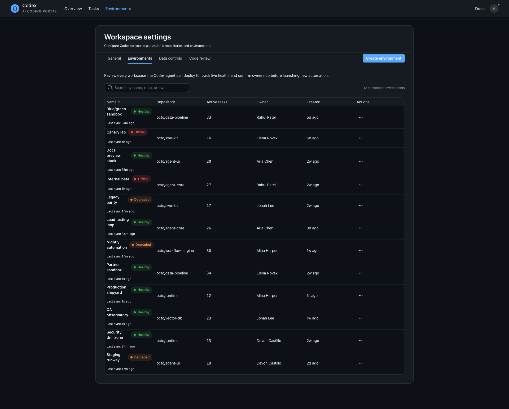
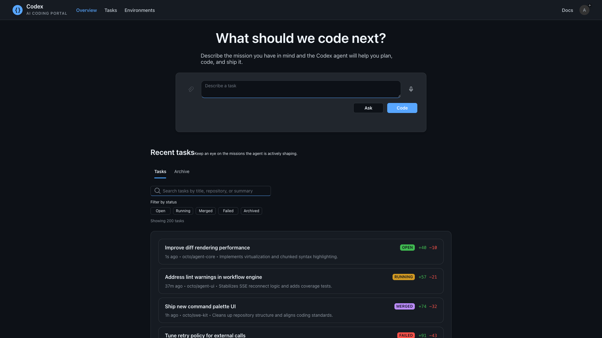

# Agent Frontend Documentation

This directory contains comprehensive documentation for the Agent Frontend application.

## Documentation Structure

- **[API Documentation](./api/)** - API endpoints and data models
- **[Component Documentation](./components/)** - React component usage and props
- **[Architecture Documentation](./architecture/)** - System design and architectural decisions
- **[Development Guide](./development/)** - Setup, workflow, and contribution guidelines
- **[Deployment Guide](./deployment/)** - Production deployment instructions
- **[Screenshots](./screenshots/)** - Visual documentation of all application pages

## Quick Start

1. See [Development Setup](./development/setup.md) for initial environment configuration
2. Review [Architecture Overview](./architecture/overview.md) to understand the system design
3. Check [Component Guide](./components/README.md) for UI component documentation
4. Browse [Screenshots](./screenshots/) for visual reference of the application

## Application Overview

The Agent Frontend is a React + TypeScript application built with Vite that provides a user interface for managing AI agent tasks and environments. It features:

- **Task Management** - Create, track, and manage AI agent tasks
- **Environment Configuration** - Set up and manage development environments
- **Voice Input** - Speech-to-text input for task descriptions
- **Real-time Updates** - Live task status and progress monitoring
- **Responsive Design** - Optimized for desktop and mobile devices

## Screenshots

### Home Page

### Tasks Page

### Settings Page

### Viewport View

## Technology Stack

- **Frontend**: React 18, TypeScript, Vite
- **UI Library**: Fluent UI (Microsoft)
- **State Management**: React Query, Zustand
- **Routing**: React Router v7
- **Styling**: Griffel (CSS-in-JS)
- **Testing**: Vitest, React Testing Library
- **Build Tool**: Vite
- **Package Manager**: npm

## Getting Help

- Check the [Development Guide](./development/) for common development tasks
- Review [Component Documentation](./components/) for UI component usage
- See [Architecture Documentation](./architecture/) for system design details
- Refer to the main [README.md](../README.md) for project overview